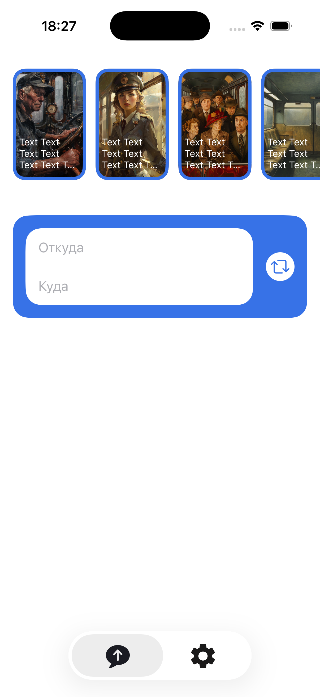
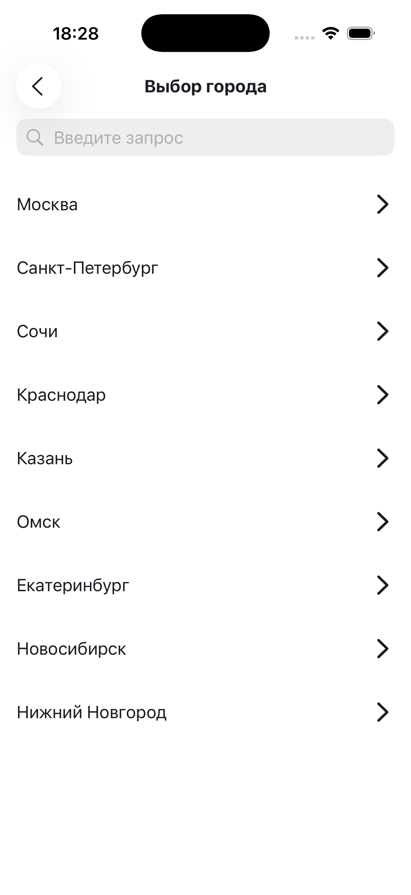
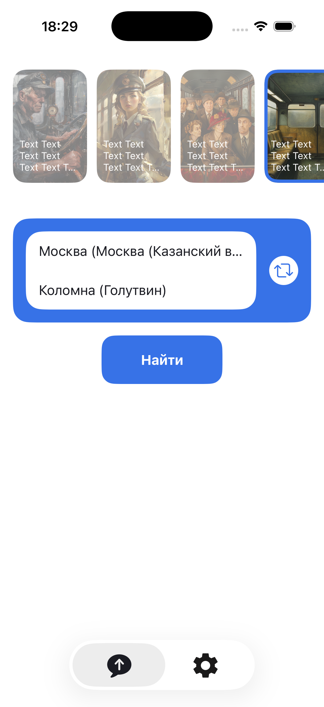
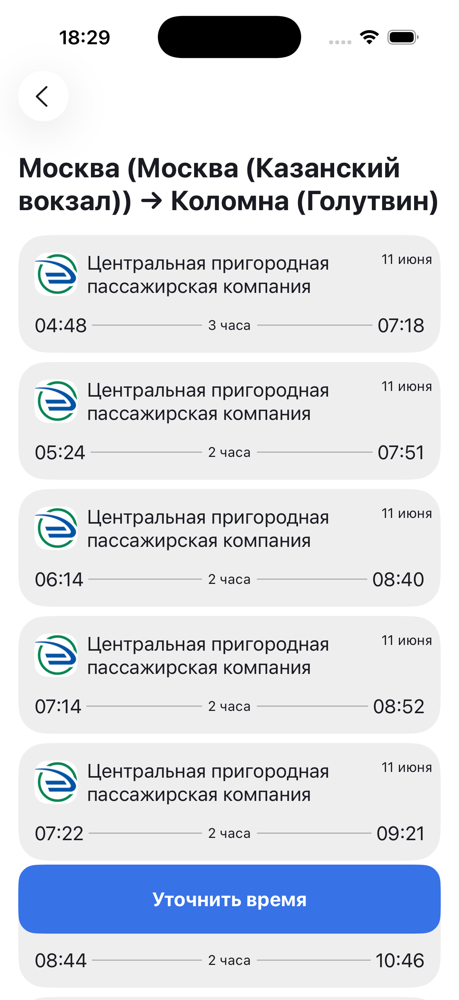
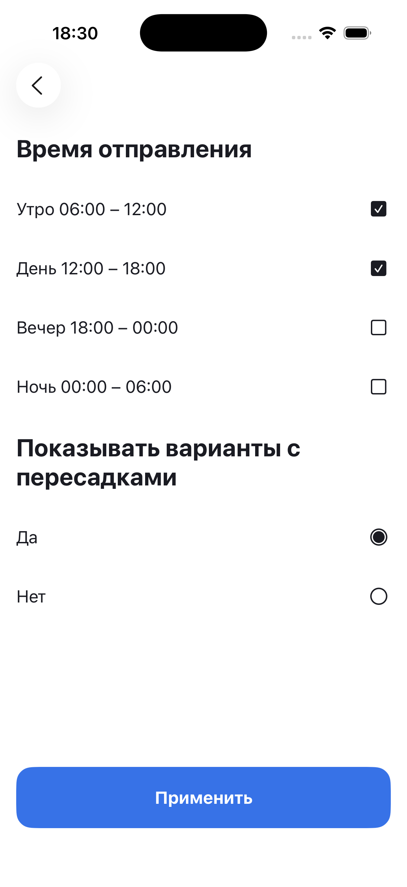
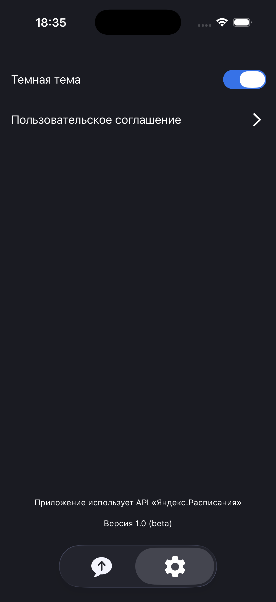

# TravelSchedule

iOS-приложение для поиска железнодорожных маршрутов между станциями. Пользователь может выбрать точки отправления и прибытия, получить актуальное расписание через API Яндекс Расписаний, настроить фильтры и посмотреть информацию о перевозчике.

Индивидуальный проект, самостоятельно реализованный по готовым требованиям и дизайн-макетам.

## Демо

https://github.com/user-attachments/assets/347bbcd8-0163-4c01-af08-fc81e0874de6

## Основной функционал

- Выбор города и станции отправления и прибытия.
- Поиск городов и станций по названию.
- Отображение списка популярных городов.
- Быстрая смена направлений маршрута.
- Загрузка актуального расписания между выбранными станциями.
- Отображение перевозчика, даты, времени отправления и прибытия, продолжительности поездки и наличия пересадок.
- Фильтрация рейсов по времени отправления и наличию пересадок.
- Просмотр логотипа и контактной информации перевозчика.
- Кеширование справочника станций и загруженных расписаний.
- Защита от повторных параллельных сетевых запросов.
- Обработка загрузки, отсутствия результатов, ошибок сервера и отсутствия интернета.
- Просмотр Stories с автоматическим переключением и индикатором прогресса.
- Переключение страниц Stories тапами и горизонтальными свайпами.
- Закрытие Stories кнопкой или свайпом вниз.
- Индикация просмотренных Stories.
- Поддержка светлой и темной темы.
- Сохранение выбранной темы между запусками приложения.

## Требования и технологии

- iOS 17+
- Swift 5
- SwiftUI
- MVVM
- Combine (`ObservableObject`, `@Published`, `AnyCancellable`, `Timer.publish`)
- Swift Concurrency (`async/await`, `actor`, `@MainActor`, `Sendable`)
- REST API Яндекс Расписаний
- OpenAPI
- AppStorage
- Swift Package Manager

## Зависимости

- `swift-openapi-generator` — генерация типизированного клиента и моделей по OpenAPI-схеме.
- `swift-openapi-runtime` — инфраструктура для работы сгенерированного OpenAPI-клиента.
- `swift-openapi-urlsession` — выполнение сетевых запросов OpenAPI-клиента через URLSession.

## Скриншоты

| Главный экран | Выбор города | Поиск станции |
|:-------------:|:-------------:|:-------------:|
|  |  |  |

| Выбранный маршрут | Расписание | Фильтры расписания |
|:-----------------:|:----------:|:------------------:|
|  |  |  |

| Просмотр Stories | Информация о перевозчике | Темная тема |
|:----------------:|:------------------------:|:-----------:|
|  |  |  |

## Установка и запуск

1. Клонировать репозиторий:

```bash
git clone https://github.com/av-black/TravelSchedule.git
```

2. Перейти в папку проекта:

```bash
cd TravelSchedule
```

3. Открыть проект:

```bash
open TravelSchedule.xcodeproj
```

4. Выбрать симулятор iPhone или подключенное устройство с iOS 17+.

5. Собрать и запустить приложение.

Зависимости подключены через Swift Package Manager и загружаются Xcode автоматически.
